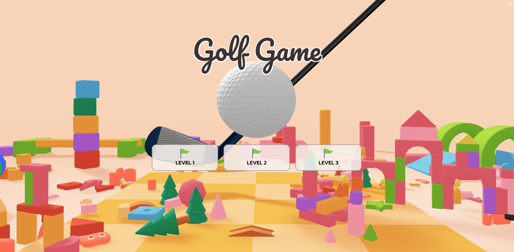

# 3D Golf Game Simulation

Golf is a popular sport enjoyed by millions worldwide, but not everyone has access to golf courses or time to play. This project aims to develop basic 3D golf game in web application using Three.js, a popular JavaScript library to create 3D graphics on the web, to give some golf experience to players.

This project is a part of Realtime Computer Graphics, Physics Simulation (2/2023).
See more explanation from the video: https://youtu.be/SY-s1eeksLA?si=Dh3Rp9BNbZb44VcU
